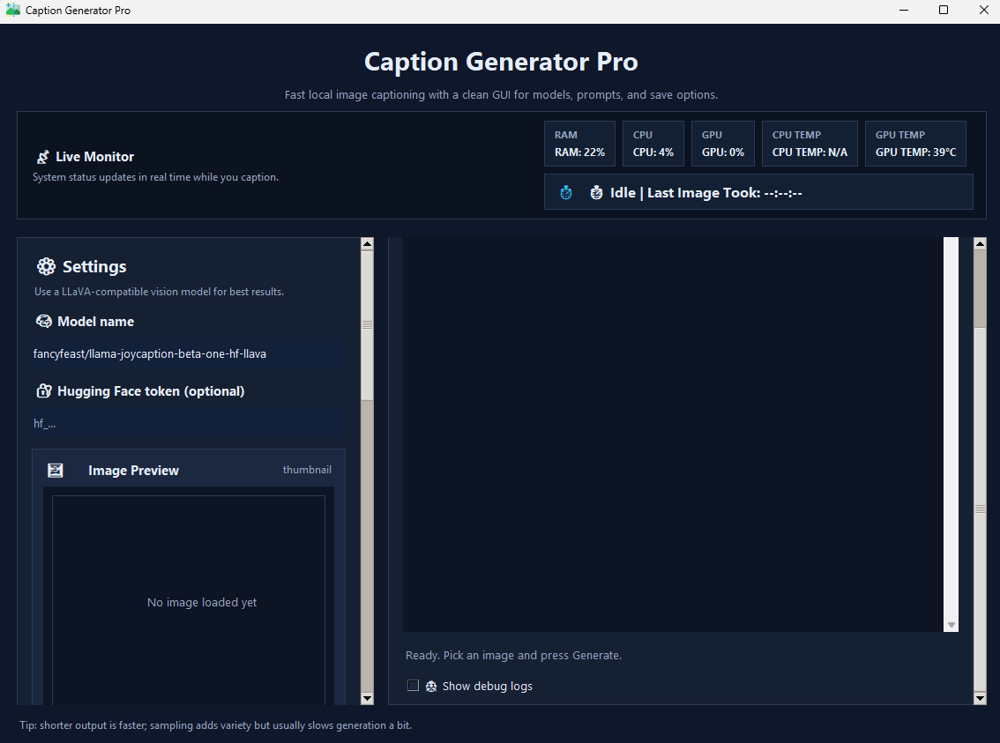

# Caption Generator Pro

> A clean Tkinter desktop app for generating high-quality image captions with LLaVA-style vision-language models.

## Preview



## Features

- Single-image caption generation
- Multi-image folder captioning for batch processing
- Editable prompt box for custom caption style
- Adjustable output length and generation settings
- Optional Hugging Face token support for private models
- Save captions as `.txt` or `.json`
- Image preview and a responsive background UI

## Recommended Setup

Before running the app, create a virtual environment and install the dependencies inside it.

### Windows CMD

```cmd
cd "C:\Users\Admin\Desktop\Python\Data Science"
python -m venv .venv
.venv\Scripts\activate
pip install -r requirements.txt
python code\caption_generator.py
```

### Windows PowerShell

```powershell
cd "C:\Users\Admin\Desktop\Python\Data Science"
python -m venv .venv
.venv\Scripts\Activate.ps1
pip install -r requirements.txt
python code\caption_generator.py
```

## Quick Start

If you prefer the bundled launcher, you can still use `startui.bat` after setup. However, running `code/caption_generator.py` directly is fully supported and is often the faster option during development.

## Usage

### Single-image mode

1. Leave **Enable multi-image folder mode** unchecked.
2. Pick one image in **Image path**.
3. Optionally choose a **Save path**.
4. Click **Generate Caption**.

### Multi-image mode

1. Turn on **Enable multi-image folder mode**.
2. Choose the folder that contains your images.
3. Choose a folder where the captions should be saved.
4. Optionally set a **Filename prefix**.
5. Click **Generate Batch Captions**.

## Tips

- Shorter captions usually generate faster.
- The app supports common image formats like PNG, JPG, JPEG, WEBP, BMP, TIF, and TIFF.
- If you do not enter a save path, the caption will only show in the app.